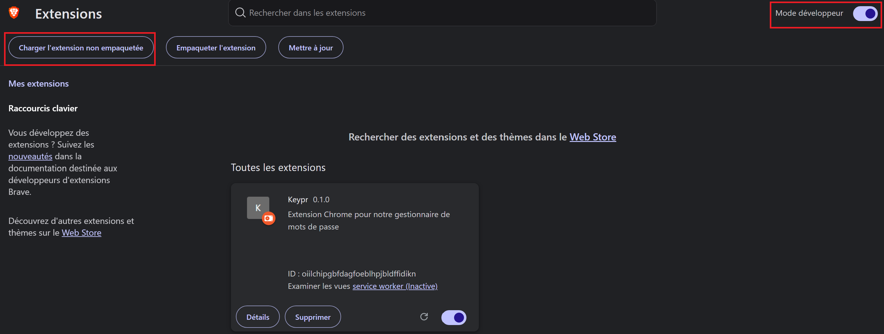
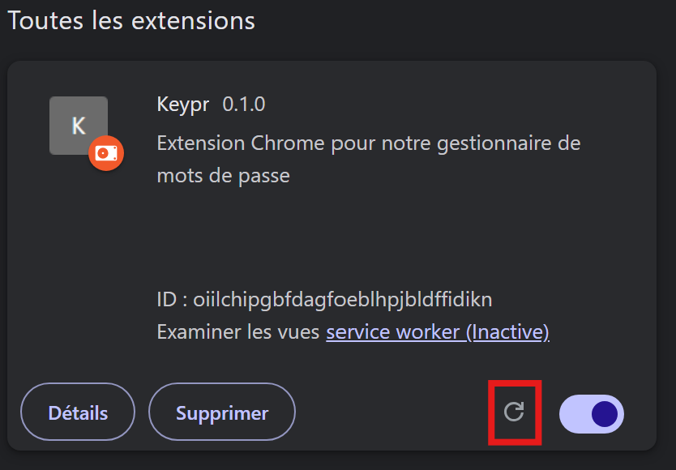
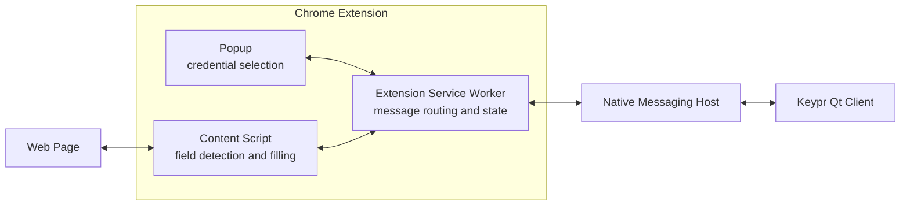

# Keypr browser extension

Keypr is a Chrome extension for the Keypr password manager. It detects login forms,
retrieves matching credentials through Chrome Native Messaging, and fills the selected
credentials into the page.

## Requirements

- Node.js 22 (the version used by CI)
- npm
- Google Chrome or another Chromium-based browser
- The Keypr Qt client and its Native Messaging host for credential retrieval

## Run locally

Clone the repository and install the exact dependency versions:

```bash
git clone https://github.com/Keypr-org/browser_extension.git
cd browser_extension
npm ci
```

Build the unpacked extension:

```bash
npm run build
```

The build creates the `dist/` directory. To load it in Chrome:

1. Open `chrome://extensions`.
2. Enable **Developer mode**.
3. Click **Load unpacked**.
4. Select the repository's `dist/` directory.



After changing source files, rebuild with `npm run build`, then click the reload
button for the extension on the extensions page.



Useful development commands:

```bash
npm test       # Run the test suite once
npm run lint   # Check code style and errors
npm run build  # Type-check and create dist/
npm run clean  # Remove dist/
```

The extension can be loaded without the Qt client, but native credential retrieval
will not work until the Native Messaging host is installed and configured.

## Architecture



The source code is organised by Chrome extension runtime context:

- `src/content/entry.ts` is the content-script entry point. It watches page DOM
  changes with a `MutationObserver`, detects login fields, adds credential icons,
  and receives commands to fill fields.
- `src/background/service-worker.ts` is the central coordinator. It handles tab
  events, routes messages, stores detected field locations, retrieves entries and
  passwords, and sends results back to the popup or content script.
- `src/popup/popup.ts` and `src/popup/popup.html` implement the extension popup.
  The popup requests credentials and displays entries or native-host errors.
- `src/utils/` contains shared code: message types and protocols, field discovery,
  credential icon rendering, and Native Messaging communication.
- `src/style/` and `src/img/` contain popup and content-script assets.
- `manifest.json` declares the Manifest V3 service worker, content scripts,
  permissions, icons, popup, and web-accessible resources.

At runtime, the flow is:

1. The content script detects a username or password field and reports its location to the service worker.
2. The service worker asks the native host for entries matching the current URL.
3. The popup or credential icon displays the available entries.
4. Selecting an entry causes the service worker to request its password and send the credentials to the content script for filling.

The build uses TypeScript for type-checking, Vite for the login-fields bundle, and
copies the manifest, popup, styles, and images into `dist/`.

## Native Messaging

`manifest.json` pins a `"key"` so the extension always loads with the same ID,
`lfmecfelolhliggpdajjbpciggaapmgb`, regardless of who builds it or where `dist/`
is loaded from. Do not regenerate it,
because the Qt client's Native Messaging host manifest must use the matching
extension origin in `allowed_origins`.

## CI/CD

GitHub Actions runs the workflow in `.github/workflows/extension-ci.yml` on every
pull request and on pushes to `main` or `develop`. It uses Node.js 22 and runs the
following gates in order:

1. `npm ci`
2. `npm run lint`
3. `npm test`
4. `npm run build`
5. Package `dist/` as `chrome-extension.zip` and upload it as a workflow artifact

On a successful push to `main`, the workflow downloads that artifact and uploads
it to the Chrome Web Store. Publishing requires the repository secrets
`EXTENSION_ID`, `PUBLISHER_ID`, `CHROME_CLIENT_ID`, `CHROME_CLIENT_SECRET`, and
`CHROME_REFRESH_TOKEN`. The credential check workflow can be started manually
from GitHub Actions to verify the Chrome Web Store API credentials without
publishing an extension.

### Adding a functionality to the CI/CD pipeline

When a new functionality needs a pipeline check or delivery step:

1. Add or update the relevant automated tests in `tests/` and make sure the check can run non-interactively on Ubuntu.
2. Add the command to `package.json` when it is a reusable project operation (for example, `npm run typecheck` or `npm run audit`). Prefer an npm script so the same command works locally and in GitHub Actions.
3. Add a named step in the `test-and-build` job of `.github/workflows/extension-ci.yml`, placing quality gates before packaging and publishing steps.
4. If the functionality needs files in the packaged extension, update the build scripts and verify that the expected files exist under `dist/` before the ZIP step.
5. Open a pull request and confirm that the complete workflow passes before merging. For a delivery change, also inspect the generated artifact from the workflow run.

## Contributing

1. Create a branch from `develop` with a focused name, such as `feat/improved-field-detection` or `fix/popup-error-state`.
2. Make the smallest change that implements the functionality and add tests for changed behavior. Keep shared message definitions in `src/utils/messages.ts`.
3. Run the local checks before opening a pull request:

	```bash
	npm run lint
	npm test
	npm run build
	```

4. Describe the behavior change, test coverage, and any Native Messaging or browser setup needed to review it.
5. Keep pull requests focused and respond to CI failures before requesting merge.

Do not commit generated `dist/` output or secrets. Preserve the pinned extension
key and coordinate changes to the Qt Native Messaging host when the message
protocol or extension ID changes.

## Use of AI

AI tools were used during development to help with documentation and implementation support. All generated
suggestions were reviewed by the project contributors, adapted to the repository's
architecture, and validated with the project's tests, lint checks, and build.
